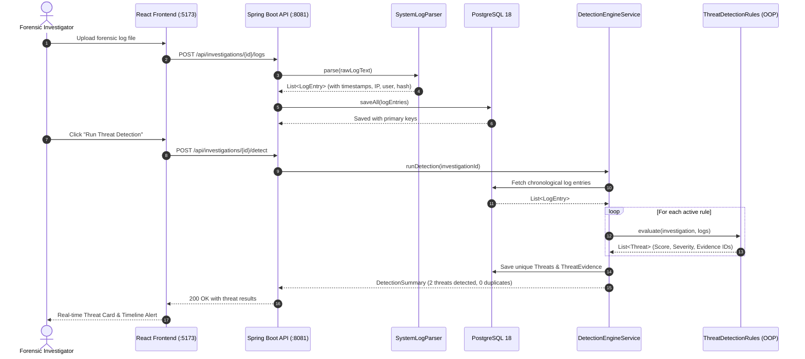

# SentinelForensic – System Architecture & Technical Design

## 1. Executive Architecture Overview

SentinelForensic is an enterprise-grade digital incident triage and forensic timeline reconstruction platform engineered for cybersecurity incident response teams, SOC tier-1/tier-2 analysts, and forensic investigators.

The application follows a clean layered architecture adhering to SOLID principles, separation of concerns, and classic Object-Oriented Design patterns.

```mermaid
graph TD
    subgraph Frontend ["Frontend Client (React 19 + TypeScript)"]
        UI[Tailwind CSS v4 + Dark SOC UI]
        Router[React Router DOM]
        State[Axios API Client + React State]
        ViteProxy[Vite Dev Server :5173 / Proxy]
    end

    subgraph Backend ["Backend Engine (Spring Boot 3.2.4 / Java 21)"]
        API[REST Controller Layer]
        DTO[DTO & Validation Layer]
        
        subgraph CoreServices ["Service & Domain Logic Layer"]
            InvService[InvestigationService]
            ParserService[Parser Service & Factory]
            Engine[DetectionEngineService]
            Timeline[TimelineService]
            Report[ReportService (Apache PDFBox 3.x)]
        end

        subgraph OOPRules ["Polymorphic Rule Engine"]
            IRule["<<interface>> ThreatDetectionRule"]
            AbstractRule["AbstractThreatDetectionRule"]
            BF["BruteForceDetectionRule"]
            PE["PrivilegeEscalationRule"]
            AF["AuthenticationFailureRule"]
            AC["AccountCreationRule"]
            MP["MalwarePersistenceRule"]
            DP["DataExfiltrationRule"]
            SC["SuspiciousCommandRule"]
        end

        subgraph Persistence ["Persistence Layer (Spring Data JPA)"]
            Repo[JPA Repositories]
            Hibernate[Hibernate ORM 6.4]
            Flyway[Flyway Migrations V1-V6]
        end
    end

    subgraph Storage ["Database Layer"]
        PG[(PostgreSQL 18 :5432)]
    end

    UI --> Router --> State --> ViteProxy
    ViteProxy -->|"/api/**" Proxy| API
    API --> DTO --> InvService
    InvService --> ParserService
    InvService --> Engine
    InvService --> Timeline
    InvService --> Report
    Engine --> IRule
    AbstractRule -.->|implements| IRule
    BF --|> AbstractRule
    PE --|> AbstractRule
    AF --|> AbstractRule
    AC --|> AbstractRule
    MP --|> AbstractRule
    DP --|> AbstractRule
    SC --|> AbstractRule
    InvService --> Repo
    Engine --> Repo
    Repo --> Hibernate --> PG
```

---

## 2. Core Java & Object-Oriented Design (OOP) Principles

SentinelForensic is architected to showcase core computer science and software engineering principles in modern Java 21:

### 2.1 Abstraction
- **`ThreatDetectionRule` Interface**: Defines the contract for all threat detection strategies (`getRuleId()`, `getRuleName()`, `evaluate(Investigation, List<LogEntry>)`, `isEnabled()`).
- **`LogParser` Interface**: Defines standard log extraction contracts (`parse(String rawContent, Long investigationId)`).
- **Service Interfaces**: Service boundaries decouple web controllers from underlying persistence and algorithmic logic.

### 2.2 Inheritance & Code Reusability
- **`AbstractThreatDetectionRule`**: Base class implementing common detection mechanics:
  - Log sorting by timestamp
  - Sliding time-window calculation (`isWithinWindow(Instant t1, Instant t2, Duration window)`)
  - Deterministic duplicate prevention (`threatRepository.findByInvestigationIdAndRuleId(...)`)
  - Threat evidence linking (`ThreatEvidence` entity instantiation)
  - Mathematical detection score normalization.
- Concrete rules (`BruteForceDetectionRule`, `PrivilegeEscalationRule`, etc.) extend this base class and specialize purely on their respective heuristic logic.

### 2.3 Polymorphism & Strategy Pattern
- **Polymorphic Rule Dispatch**: Spring Boot automatically discovers and autowires all Spring `@Component` beans implementing `ThreatDetectionRule` into a `List<ThreatDetectionRule>`.
- The `DetectionEngineService` executes evaluations polymorphically without needing `switch` statements or concrete class awareness:
  ```java
  for (ThreatDetectionRule rule : activeRules) {
      List<Threat> detected = rule.evaluate(investigation, logEntries);
      persistedThreats.addAll(saveUniqueThreats(detected));
  }
  ```

### 2.4 Encapsulation & Domain Invariants
- JPA entities (`Investigation`, `LogEntry`, `Threat`, `ThreatEvidence`, `InvestigationNote`) maintain private fields with controlled getters, setters, and builder/constructor patterns.
- Scoring and Severity Overrides: Invariants such as overriding severity to `CRITICAL` when an account lock follows brute-force activity are strictly encapsulated within the detection rule rather than exposed to UI manipulation.

### 2.5 Exception Handling Hierarchy
- Custom unchecked runtime exceptions inheriting from `SentinelForensicException`:
  - `ResourceNotFoundException`: Thrown on missing cases, logs, or threats (mapped to HTTP 404).
  - `LogParsingException`: Thrown on unparseable lines or malformed headers (mapped to HTTP 400).
  - `ReportGenerationException`: Thrown on PDFBox rendering failures (mapped to HTTP 500).
- `GlobalExceptionHandler` with `@RestControllerAdvice`: Transforms all application exceptions into RFC 7807 compliant JSON error responses with trace IDs and clear error messages.

### 2.6 Modern Collections & Java Streams
- Extensive use of the Java Stream API:
  - Event grouping by IP (`Collectors.groupingBy(LogEntry::getSourceIp)`)
  - Event filtering by event type and time ranges
  - Chronological timeline construction and chronological ordering.

---

## 3. Package & Directory Structure

```
backend/
├── pom.xml
└── src/
    ├── main/
    │   ├── java/com/sentinelforensic/
    │   │   ├── SentinelForensicApplication.java
    │   │   ├── config/
    │   │   │   ├── AppConfig.java
    │   │   │   └── WebMvcConfig.java
    │   │   ├── controller/
    │   │   │   ├── InvestigationController.java
    │   │   │   ├── ThreatController.java
    │   │   │   ├── LogController.java
    │   │   │   ├── ReportController.java
    │   │   │   ├── HealthController.java
    │   │   │   └── DashboardController.java
    │   │   ├── dto/
    │   │   │   ├── request/
    │   │   │   │   ├── CreateInvestigationRequest.java
    │   │   │   │   ├── LogIngestRequest.java
    │   │   │   │   ├── AddNoteRequest.java
    │   │   │   │   └── UpdateThreatStatusRequest.java
    │   │   │   └── response/
    │   │   │       ├── InvestigationSummaryResponse.java
    │   │   │       ├── DetectionResultResponse.java
    │   │   │       ├── TimelineEventResponse.java
    │   │   │       └── DashboardSummaryResponse.java
    │   │   ├── entity/
    │   │   │   ├── Investigation.java
    │   │   │   ├── LogEntry.java
    │   │   │   ├── Threat.java
    │   │   │   ├── ThreatEvidence.java
    │   │   │   ├── InvestigationNote.java
    │   │   │   ├── RuleConfig.java
    │   │   │   └── enums/
    │   │   │       ├── InvestigationStatus.java
    │   │   │       ├── Severity.java
    │   │   │       ├── ThreatStatus.java
    │   │   │       └── EventType.java
    │   │   ├── exception/
    │   │   │   ├── SentinelForensicException.java
    │   │   │   ├── ResourceNotFoundException.java
    │   │   │   ├── LogParsingException.java
    │   │   │   └── GlobalExceptionHandler.java
    │   │   ├── parser/
    │   │   │   ├── LogParser.java
    │   │   │   ├── SystemLogParser.java
    │   │   │   └── SecurityLogParser.java
    │   │   ├── repository/
    │   │   │   ├── InvestigationRepository.java
    │   │   │   ├── LogEntryRepository.java
    │   │   │   ├── ThreatRepository.java
    │   │   │   ├── ThreatEvidenceRepository.java
    │   │   │   ├── InvestigationNoteRepository.java
    │   │   │   └── RuleConfigRepository.java
    │   │   ├── rule/
    │   │   │   ├── ThreatDetectionRule.java
    │   │   │   ├── AbstractThreatDetectionRule.java
    │   │   │   ├── BruteForceDetectionRule.java
    │   │   │   ├── PrivilegeEscalationRule.java
    │   │   │   ├── AuthenticationFailureRule.java
    │   │   │   ├── AccountCreationRule.java
    │   │   │   ├── MalwarePersistenceRule.java
    │   │   │   ├── DataExfiltrationRule.java
    │   │   │   └── SuspiciousCommandRule.java
    │   │   └── service/
    │   │       ├── InvestigationService.java
    │   │       ├── DetectionEngineService.java
    │   │       ├── TimelineService.java
    │   │       ├── ReportService.java
    │   │       └── DashboardService.java
    │   └── resources/
    │       ├── application.properties
    │       └── db/migration/
    │           ├── V1__create_investigations_table.sql
    │           ├── V2__create_log_entries_table.sql
    │           ├── V3__create_threats_table.sql
    │           ├── V4__create_threat_evidence_table.sql
    │           ├── V5__create_investigation_notes_table.sql
    │           └── V6__create_rule_configs_table.sql
```

---

## 4. End-to-End Data Processing Pipeline



---

## 5. Security & Forensics Invariants

1. **Evidence Integrity**: Log entries are immutable once ingested. Timestamps, raw messages, source/destination IPs, usernames, and SHA-256 hashes are preserved for chain of custody.
2. **Deterministic Deduplication**: Multiple clicks on "Run Threat Detection" evaluate rules deterministically. Existing open or confirmed threats are not duplicated in the database.
3. **Audit Trail**: Every threat links to its source evidence entries via foreign keys in `threat_evidence`, allowing investigators to inspect the exact lines of raw log text that triggered the alert.
